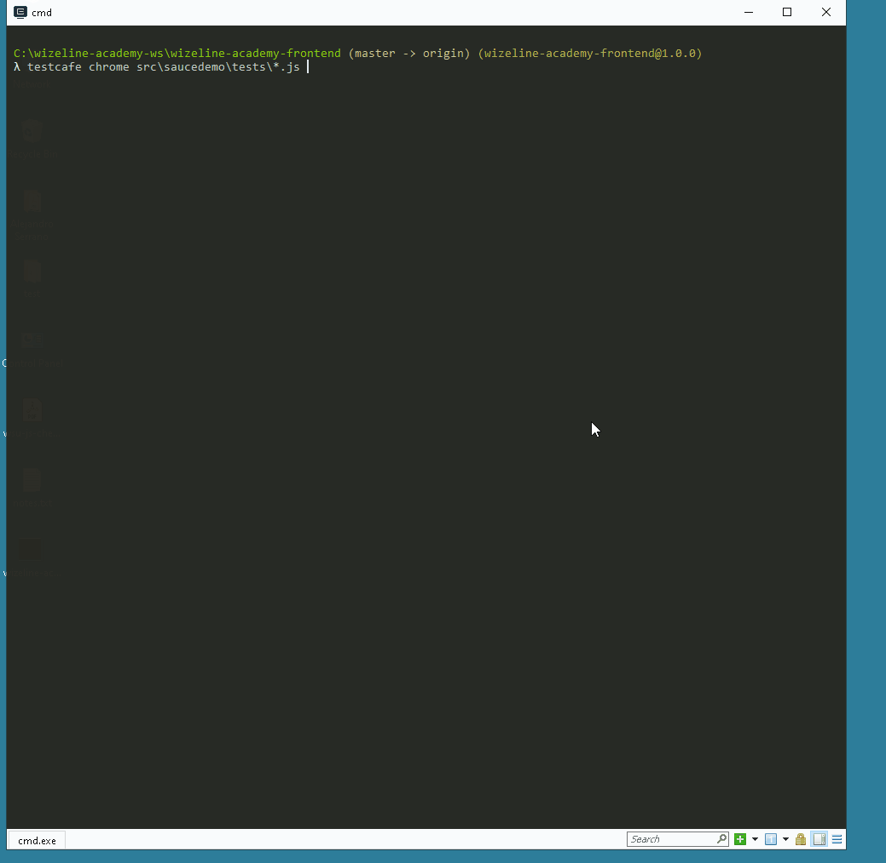

## Wizeline FullStack QA Certification - Front End - TestCafe
This repository contains a practice of what we learned in the Wizeline FullStack QA Certification Day 1.

### Getting Started
1. Ensure that [Node.js] (https://nodejs.org/en/) and npm are installed on your computer.
2. Clone this repository or download the zip with the source code in to your local system.
```
git clone https://github.com/alejandro-serrano/wizeline-academy-frontend.git
```
3. Change directory to the folder where the code of this project lives in your local system.
4. Install test cafe.
```
npm install -g testcafe
```

### Running the tests
1. You can run the tests suite from a command shell by calling the following command.
```
testcafe chrome src\saucedemo\tests\*.js
```

### Demo


### Areas to improve
I'm still learning JS, I have struggled when trying to implement other design patterns like Factory or Command or even something simpler as inheritance in this language. Hopefully, next version will be better.
